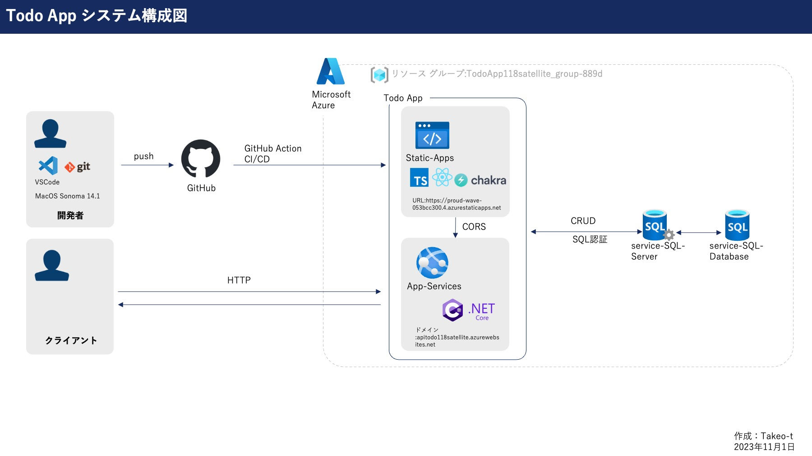
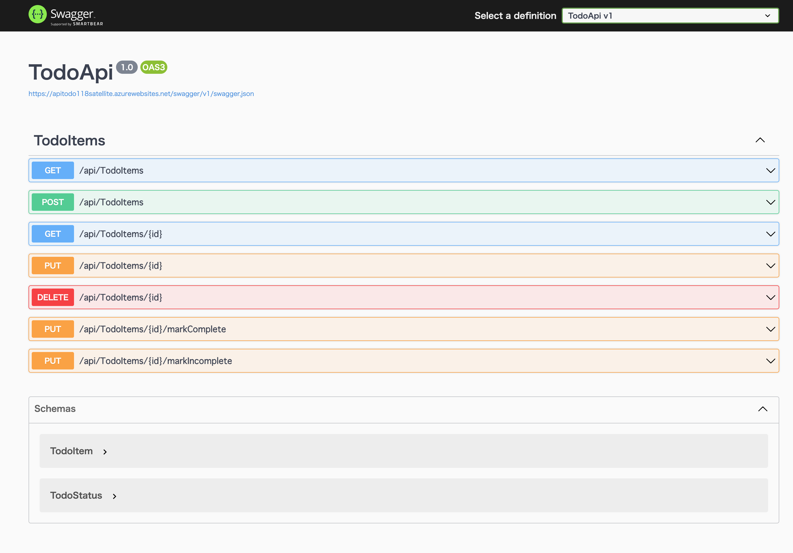
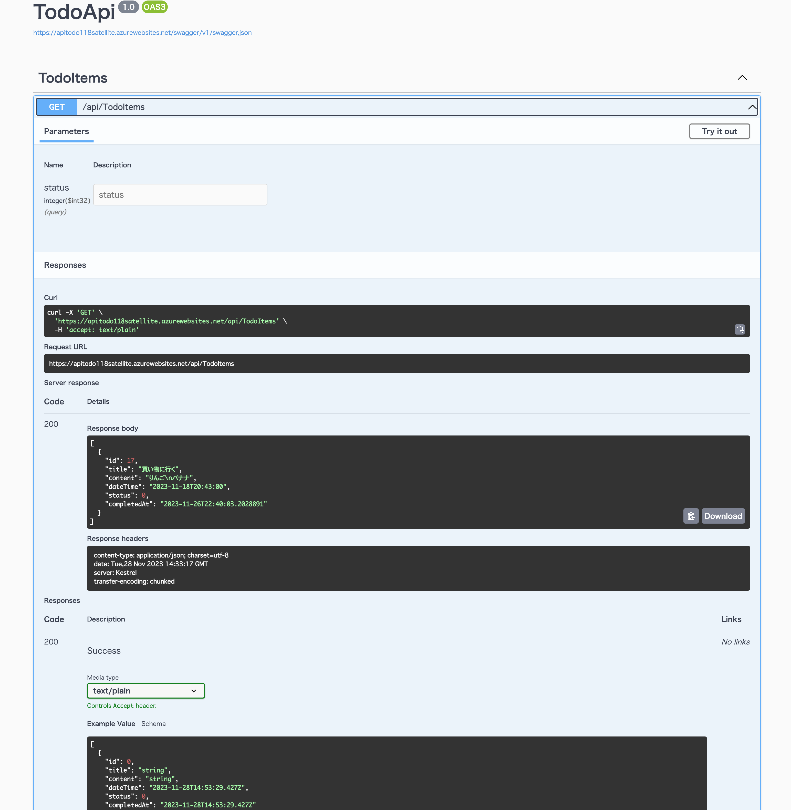

# 1.プロジェクト名：　TODO API

# 2.アプリケーションの概要  
## 2-1. システム構成  
本アプリケーションはTodoアプリケーションのバックエンド部分を担当します。  
主要な機能は下記に示す通りです。また()内に各機能のエンドポイントを示します。  
さらに、システム構成を下記に示します。  
  

## 2-2. 技術選定について  
本アプリケーションはC#で記述され、フレームワークは.NETcore7を用いています。  
.NETcore7はクロスプラットフォーム対応という特徴がありWindows、macOS、Linuxで動作するため、様々なOSで開発することができます。  
また、高いパフォーマンスを発揮できるため、レスポンス時間が期待できます。  
さらにAzureのサービス（例えばAzure App Serviceなど）に容易にデプロイすることができます。  
これらのメリットを享受するため.NETcore7を導入しました。

## 2-3. 各機能のエンドポイントについて  
## 取得(GET)  
##### 全TODOを取得する機能([GET]/api/TodoItems)  
##### 未完了TODOのみ取得する機能([GET]/api/TodoItems?status=0`)  
##### 完了済TODOのみ取得する機能([GET]/api/TodoItems?status=1)  
未完了・完了の区別はクエリパラメータを用いてフィルタリングしています。  
クエリパラーメータを使用することでデータベースのテーブル設計を効率的に行うことができます。  
また、完了、未完了のステータス以外にも緊急や実行中など新たなステータスを設けることも容易に可能です。  

## 追加(POST)  
##### TODOを追加する機能([POST]/api/TodoItems)  

## 変更(PUT)  
##### TODOを変更する機能([PUT]/api/TodoItems/{id})  
##### 完了(/api/TodoItems/{id}/markIncomplete)  
##### 未完了に戻す(/api/TodoItems/{id}/markComplete)  

## 削除(DELETE)  
##### TODOを削除する機能([DELETE]api/TodoItems/{id})  

# 3.データモデルについて
データモデルを示します。
```Models/TodoItem.cs
namespace TodoApi.Models;

public class TodoItem
{
    public long Id { get; set; }
    public string Title { get; set; } = string.Empty; //string 型で、Todoアイテムのタイトルを表します。
    public string Content { get; set; } = string.Empty; //string 型で、Todoアイテムの内容や詳細を表します。
    public DateTime DateTime { get; set; } //DateTime 型で、Todoアイテムが作成された日時や予定日時など、日時に関連する情報を保持します。
    public TodoStatus Status { get; set; } //TodoStatus 型でTodoアイテムの状態（例：未完了、完了）を示します。
    //ステータスナンバーの意味について、0は未完了、1は完了を示します。
    public DateTime? CompletedAt { get; set; } //DateTime? 型で、Todoアイテムが完了した日時を示します。このプロパティは null 許容型（DateTime?）であるため、値がない場合（つまりアイテムが未完了の場合）は null になります。
}
```
時刻は協定世界時（UTC）で記録されるため、日本標準時で表示する場合はフロント側のアプリケーションで対応する必要があります。
```js/日本標準時で表示する場合の記述例
const formattedDate = moment(rawDate).format('YYYY年MM月DD日HH時mm分');
```

# 4.依存関係について
本プロジェクトの依存関係は`obj/project.assets.json`を参照してください。  

# 5.セットアップ手順
セットアップするにあたり.NETcore7のインストールを前提とします。
```
git clone https://github.com/takeo-t/TodoApi/repository.git //ローカルにセットアップ
```
```
dotnet run --launch-profile https //ビルド
```
# 6. アプリケーションのホスト先
Microsoft Azure App Appsにホストしています。  
`https://apitodo118satellite.azurewebsites.net`  

また、下記リンクからSwaggerを使用したサーバーとの接続テストを行います。  
```
`https://apitodo118satellite.azurewebsites.net/swagger/index.html`  
```
  

  
取得（GET）のテスト  

# 7. 環境変数の設定方法
ローカル開発環境ではデータベース接続文字列は`appsettings.Development.json`において設定しますが、App ServiceではApp Service>構成>アプリケーション設定に名前と値を設定します。  

# 8. 今後の課題
・入力文字数100文字以内の制限は現状フロント側に設けている機能ですが、他のアプリケーションにAPIとして提供する際100文字を超える入力ができてしまうため、バリデーション機能の追加を行う必要があります。  

# 9. 作者情報
Taiki Takeo  
E-mail takeo-t@118satellite.com  